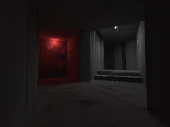

# Factory Building [3D]

This project is a small demo of realistic 3D rendering in Scratch with baked raytraced lighting. Although textured 3D projects existed at the time (December 2022), this was the first of its kind for baked lighting.

I continued with this idea and created [The Mast](https://scratch.mit.edu/projects/861541218), which is a proper game.

### Controls
* WASD to move. Arrows or mouse (click and drag) to look around.
* 1,2,3,4,5,6,7,8,9,0 keys to choose resolution.

### Credits
* Textured triangle filler by [BamBozzle](https://scratch.mit.edu/users/bambozzle/)
* Footstep sounds: https://freesound.org/people/julius_galla/sounds/434895/

## Dependencies

- [goboscript](https://github.com/aspizu/goboscript/) commit `54143f0`
- Python 3.14
- Blender 5.1

## Building

The 3D model and texture files need to be generated first. Refer to `src/models/README.md`.

To create the project, run `build.bat`. Alternatively, if you are using VSCode, run the "Build (full)" task. The completed project file is `Factory Building 3D.sb3`.

## Contributing

Feature-adding pull requests will be rejected.

I have no plans on developing this project further as I would like it to remain a simple example. While it has been updated since sharing (including the making of this repository), I would like to somewhat preserve what it was originally.
